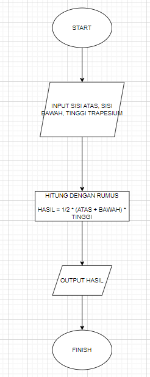

## Introduction to Programming

1. Sebutkan berbagai bahasa pemrograman yang bisa digunakan untuk mengembangkan aplikasi backend!
2. Sebutkan dan jelaskan berbagai teknologi yang perlu dipelajari untuk menjadi seorang backend engineer!

3. Buatlah sebuah flowchart untuk menghitung luas trapesium.

**Jawaban:**

1. Golang, Python, Java (referensi dari roadmap.sh)
2. teknologi wajib yang perlu dipelajari backend engineer adalah GIT sebagai version control system, Database seperti SQL, dan Basic Linux(referensi dari roadmap.sh)
3. 
