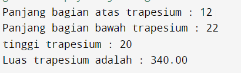
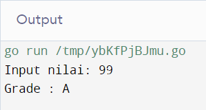
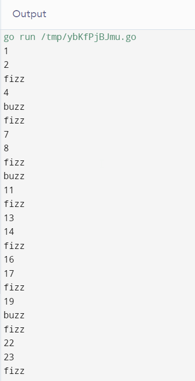
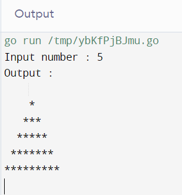
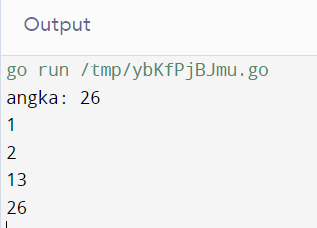

# Soal Prioritas 1

## Luas Trapesium

```
package main
import (
	"fmt"
)

func main() {

	// deklarasi variabel dan type data nya
	var top, bottom, height float32

	fmt.Print("Panjang bagian atas trapesium : ")
	fmt.Scanln(&top) // Tanda & digunakan untuk mengambil alamat variabel teratas

	fmt.Print("Panjang bagian bawah trapesium : ")
	fmt.Scanln(&bottom)

	fmt.Print("tinggi trapesium : ")
	fmt.Scanln(&height)


	wide := 0.5 * (top + bottom)* height

	fmt.Printf("Luas trapesium adalah : %.2f\n",wide)
}
```

Output



## Check Bilangan Ganjil/Genap

```
package main

import (
	"fmt"
)

func main() {
	// deklarasi variabel dan type data
	var number int64
	// meminta input angka
	fmt.Print("Masukkan angka: ")
	fmt.Scanln(&number)

	//  jika angka dapat dibagi 2 maka angka tersebut adalah genap
	if number%2 == 0 {
		fmt.Println(number, " adalah genap")
	} else {
		fmt.Println(number, " adalah ganjil")
	}

}
```

Output


## Menentukan Grade

```
package main

import (
	"fmt"
)

func main() {
	// deklarasi variable dan tipe data
	var nilai int64
	// input processing
	fmt.Print("Input nilai: ")
	fmt.Scanln(&nilai)

	switch {
	case nilai < 0 || nilai > 100:    // case kurang dari 0 dan melebihi 100
		fmt.Println("Nilai Invalid")
	case nilai >= 80 && nilai <= 100: //case grade A
		fmt.Println("Grade : A")
	case nilai >= 65 && nilai <= 79: //case grade B
		fmt.Println("Grade : B")
	case nilai >= 50 && nilai <= 64: // casse grade C
		fmt.Println("Grade : C")
	case nilai >= 35 && nilai <= 49: //case grade D
		fmt.Println("Grade : D")
	default:
		fmt.Println("Grade : E") // selain semua case diatas
	}

}
```

Outputnya banyak mas hehehe



## fizz buzz

```
package main

import (
	"fmt"
)

func main() {

	for i := 1 ; i <= 100 ; i++ {
		switch {
		case i%3 == 0:
			fmt.Println("fizz")
		case i%5 == 0:
			fmt.Println("buzz")
		default:
			fmt.Println(i)
		}
	}

}
```

Output




# Soal Prioritas 2

## Segitiga Bintang
```
package main

import (
	"fmt"
)

func main() {

	var number int

 	fmt.Print("Input number : ")
	fmt.Scanln(&number)
	fmt.Println("Output :")
	for i := 0; i <= number; i++ {
		for j := 1; j <= number-i; j++ {
			fmt.Print(" ")
		}
		for k := 1; k <= 2*i-1; k++ {
			fmt.Print("*")
		}
		fmt.Println()
	}
}
```

Output




## Faktor Bilangan
```
package main

import (
	"fmt"
)

func main() {

    var number int
    fmt.Print("angka: ")
    fmt.Scanln(&number)


    for i := 1; i <= number; i++ {
        if number%i == 0 {
            fmt.Printf("%d ", i)
            fmt.Println()
        }
       
    }
}
```

Output


