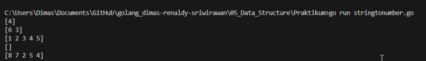

# Soal Data Structure (Array, Slice, Map), Function

## Soal Prioritas 1 (80)
- Buatlah sebuah program menggabungkan 2 array yang diberikan, dan jangan sampai terdapat nama yang sama di data yang sudah tergabung tadi!
  ********************************Jawab********************************  
[Source Code](Praktikum/mergearray.go)
Output:
  
    
- buatlah sebuah program yang dapat menghitung berapa banyak sebuah string yang sama didalam sebuah slice!
  ********************************Jawab********************************  
 [Source Code](Praktikum/lenghtinslice.go)
 Output:
   
 
- Buat program sesuai dengan deskripsi di bawah. Input merupakan variable string berisi kumpulan angka. Output merupakan list / array berisi angka yang hanya muncul 1 kali pada input.
 ********************************Jawab********************************  
[Source Code](Praktikum/stringtonumber.go)
Output 
  

# Resume - Data Structure

 - array adalah tipe data yang menyimpan banyak data dengan tipe yang sama dengan kaasitas tetap
 
 - slice adalah tipe data yang menyimpan banyak data dengan tipe yang sama tetapi kapasitasnya lebih dinamis tegantung dari penambahan dan pengurngan data
 
 - map adalah struktur penyimpanan dta dengan sebuah kunci yang unik untuk mewakikili data yang disimpan, dan kunci bersifat unik
