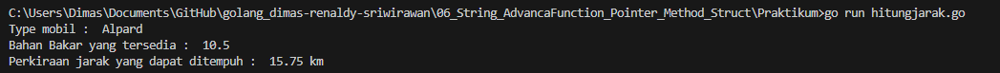
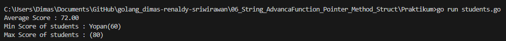
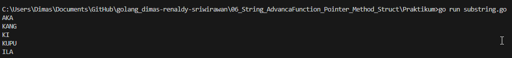
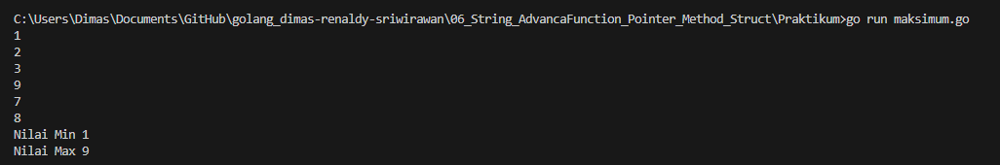

 # Soal String, Advance Function, Pointer, Struct, Method,  Interface, Package & Error Handling

## Soal Prioritas 1 
-  Buatlah sebuah *method* untuk menghitung perkiraan jarak yang bisa ditempuh berdasarkan bahan bakar yang sedang terisi (1.5 L / mill), method tersebut *receiver* kepada struct Car yang memiliki property type dan fuelIn
      ********************************Jawab :  [Source Code](Praktikum/hitungjarak.go)********************************   
    Outuput 
      
 
 - Buat sebuah struct dengan nama **Student** yang mempunyai properti **name** dan **score** dalam bentuk slice kemudian simpan data siswa sebanyak 5 siswa. Setelah 5 siswa dimasukkan maka program menunjukkan skor rata-rata, siswa yang memiliki skor minimum dan maksimal? (implementasikan method)
    ********************************Jawab :  [Source Code](Praktikum/students.go)********************************   
    Outuput 
      
 
    
- Buatlah program untuk menentukan substring yang sama di antara keduanya, dengan diberikan dua string A dan B!
    
     ********************************Jawab :  [Source Code](Praktikum/substring.go)********************************   
    Outuput 
      
 
    
- Buatlah program di Golang untuk menemukan nilai maksimum serta minimum di antara 6 angka inputan. Gunakan multiple return fungsi, pointer untuk referencing maupun deferencing!
     ********************************Jawab :  [Source Code](Praktikum/maksimum.go)********************************   
    Outuput 
      

## Sumary
- String : di golang sendiri memiliki tipe data string yang dapat digunakan untuk merepresentasikan karakter atau teks.  
- Advance Function: Golang memiliki fitur function yang cukup advance, seperti function sebagai parameter, function sebagai return value, anonymous function (closure), dan variadic function.
- Pointer: Pointer merupakan alamat memori pada variabel yang dapat digunakan untuk mengakses nilai variabel tersebut. Di Golang, kita dapat menggunakan operator & untuk mendapatkan alamat memori variabel dan operator * untuk mengakses nilai variabel yang disimpan pada alamat tersebut.
- Struct: Struct merupakan tipe data khusus pada Golang yang memungkinkan kita untuk menyimpan beberapa tipe data yang berbeda dalam satu variabel. Struct sering digunakan untuk merepresentasikan sebuah objek atau data yang kompleks.
- Method: Method pada Golang adalah function yang terkait dengan tipe data tertentu. Method biasanya digunakan untuk melakukan operasi pada variabel yang bertipe struct atau tipe data lain yang sudah didefinisikan methodnya.