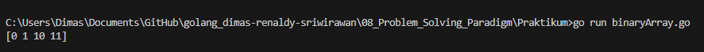
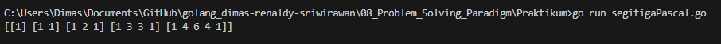
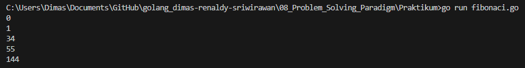
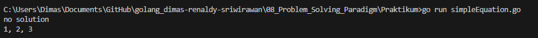

# Soal Problem Solving Paradigm - Brute Force, Greedy and Dynamic Programming

## Soal Prioritas 1

- Diberi bilangan bulat n, kembalikan array ans dengan panjang n + 1 sehingga untuk setiap i (0 <= i <= n), ans[i] adalah bilangan 1 dalam representasi biner dari i
    
    Input: n = 2
    
    Output: [0,1,10]

  Input: n = 3
  Output: [0,1,10, 11]
   ********************************Jawab :  [Source Code](Praktikum/binaryArray.go)********************************   
    Output 
      

- Diberi bilangan bulat numRows, kembalikan numRows pertama dari segitiga Pascal. Dalam segitiga Pascal, setiap angka adalah jumlah dari dua angka tepat di atasnya seperti yang ditunjukkan:
  ********************************Jawab :  [Source Code](Praktikum/segitigaPascal.go)********************************   
    Output 
      
- Angka Fibonacci adalah serangkaian angka di mana setiap angka adalah jumlah dari keduanya nomor sebelumnya. Beberapa angka Fibonacci pertama adalah: 0, 1, 1, 2, 3, 5, 8, ….
Buatlah fungsi untuk menghitung angka Fibonacci ke-n (top-down)!
    
   ********************************Jawab :  [Source Code](Praktikum/fibonaci.go)********************************   
    Output 
      
    
- Kamu memiliki tiga bilangan bulat yang berbeda, x, y dan z, yang memenuhi tiga hubungan berikut:
    - x + y + z = A
    - xyz = B
    - x^2 + y^2 + z^2 = C
    
    kamu diminta untuk menulis sebuah program yang memecahkan x, y dan z untuk nilai yang diberikan A, B dan C. (1 ≤ A, B, C ≤ 10000).
       
   ********************************Jawab :  [Source Code](Praktikum/simpleEquation.go)********************************   
    Output 
      

# Summary
- `Brute Force`
Brute Force adalah metode pemecahan masalah dengan cara mencoba `semua kemungkinan` solusi yang ada hingga ditemukan solusi yang benar atau optimal. Metode ini paling mudah diimplementasikan, namun sangat tidak `efisien` karena harus mengecek semua kemungkinan solusi yang ada.
Dalam Golang, Brute Force dapat diimplementasikan dengan cara melakukan `nested loop` untuk mencoba semua kemungkinan solusi yang ada.
- `Greedy`
Greedy adalah metode pemecahan masalah dengan cara memilih solusi yang `paling optimal` pada saat itu tanpa mempertimbangkan konsekuensi di masa depan. Metode ini lebih cepat dibandingkan Brute Force, namun hasilnya `tidak selalu optimal`.
- `Dynamic Programming`
Dynamic Programming adalah metode pemecahan masalah dengan cara `memecah` masalah besar menjadi submasalah yang lebih kecil dan menyelesaikannya secara terpisah. Solusi dari submasalah tersebut kemudian digunakan untuk menyelesaikan masalah yang `lebih besar`.
Dalam Golang, Dynamic Programming dapat diimplementasikan dengan cara membuat sebuah `fungsi rekursif` yang memecah masalah menjadi submasalah yang lebih kecil dan menyimpan solusi dari submasalah tersebut.
