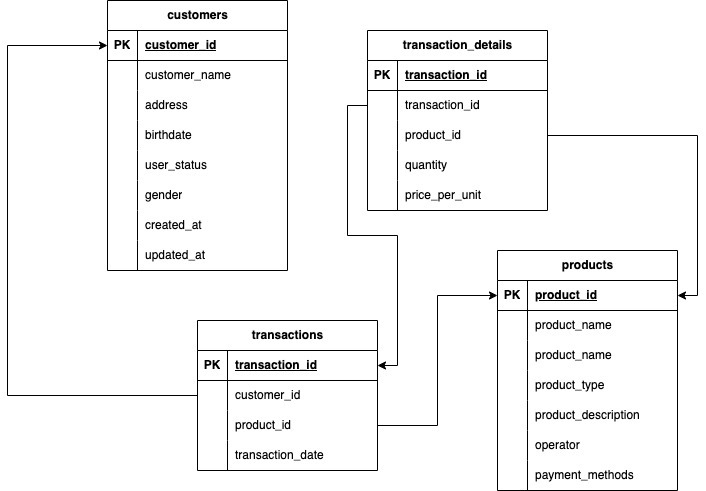
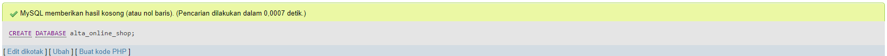
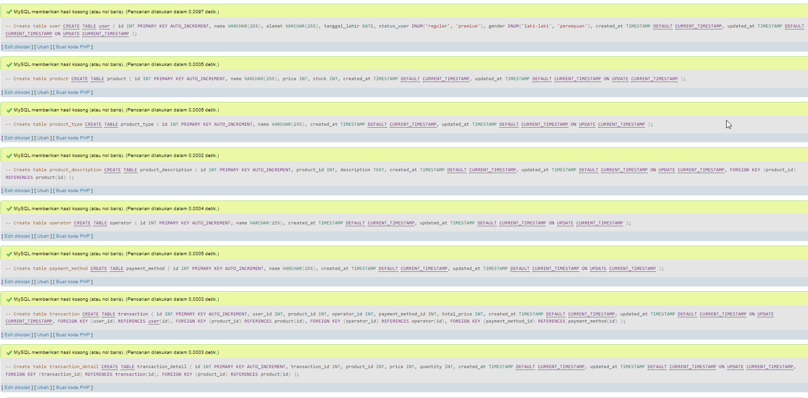
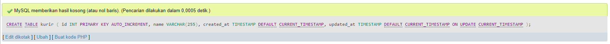
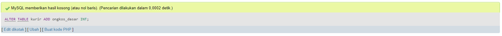
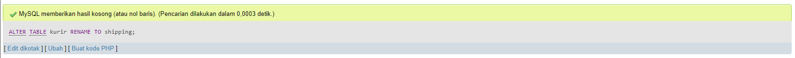
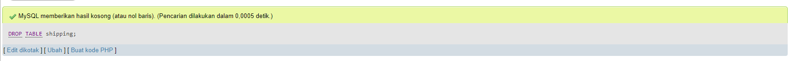
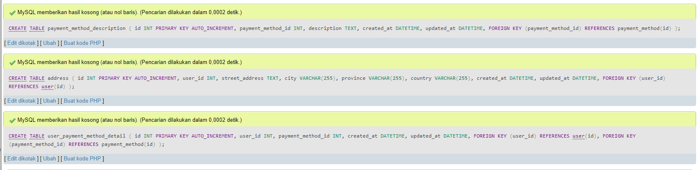
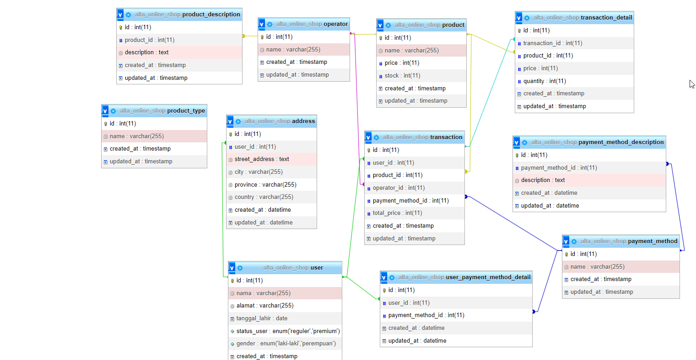

# # Praktikum Soal Database Schema, DDL, DML

### Merancang Skema Database

1. Sistem dapat menyimpan data mengenai detail item product, yaitu : product, product_type, product_description, operator, payment_methods.
2. Sistem juga harus menyimpan data mengenai pelanggan yang akan membeli product tsb diantaranya : nama, alamat, tanggal lahir, status_user, gender, created_at, updated_at.
3. Sistem dapat mencatat transaksi pembelian dari pelanggan.
4. Sistem dapat mencatat detail transaksi pembelian dari pelanggan. 
 Outuput 
      

### Data Definition Language (DDL)

1. Create database alta_online_shop.
  
2. Dari schema Olshop yang telah kamu kerjakan di, Implementasikanlah menjadi table pada MySQL.
    1. Create table user.
    2. Create table product, product type, operators, product description, payment_method.
    3. Create table transaction, transaction detail.
      
3. Create tabel kurir dengan field id, name, created_at, updated_at.
  
4. Tambahkan ongkos_dasar column di tabel kurir.
  
5. Rename tabel kurir menjadi shipping.
  
6. Hapus / Drop tabel shipping karena ternyata tidak dibutuhkan.
  
7. Silahkan menambahkan entity baru dengan relation 1-to-1, 1-to-many, many-to-many. Seperti:
    1. 1-to-1: payment method description.
    2. 1-to-many: user dengan alamat.
    3. many-to-many: user dengan payment method menjadi user_payment_method_detail.
      
 ********************************Jawab :  [Source Code](Praktikum/alta_online_shop.sql)********************************   
    Outuput dari erd query di atas
      