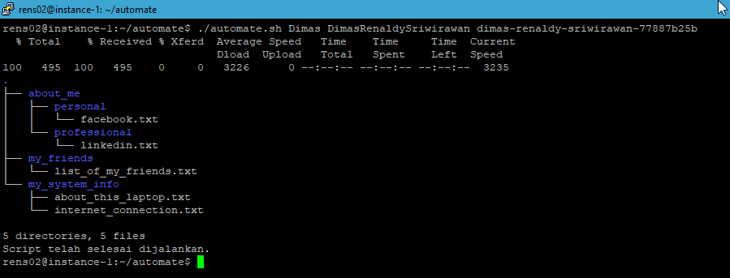

# Soal Command Line Interface (CLI)
## Soal

- Membuat sebuah skrip untuk menjalankan pekerjaan secara otomatis. Rincian soal dapat dilihat disini:
   ********************************Script :  [Source Code](Praktikum/automate.sh)********************************   
    Output 
      

# Sumarry

Command Line Interface (CLI) adalah antarmuka baris perintah yang digunakan untuk berinteraksi dengan sistem operasi melalui teks atau karakter. CLI memungkinkan pengguna untuk memasukkan perintah dan argumen terkait ke dalam prompt perintah, dan sistem akan mengeksekusi perintah yang dimaksud sesuai dengan instruksi yang diberikan. berikut contoh penggunaan CLI:

- Mengakses file dan direktori: CLI memungkinkan pengguna untuk mengakses dan mengelola file dan direktori dengan mudah, seperti membuat, menghapus, atau memindahkan file dan direktori.
- Menjalankan program dan perintah: CLI memungkinkan pengguna untuk menjalankan program dan perintah melalui prompt perintah, seperti menjalankan aplikasi, mengakses server, atau melakukan tugas administratif.
- Mengelola pengaturan sistem: CLI memungkinkan pengguna untuk mengelola pengaturan sistem, seperti konfigurasi jaringan, manajemen pengguna, atau perbaikan masalah sistem.
- Memproses dan mengelola data: CLI memungkinkan pengguna untuk memproses dan mengelola data dengan mudah, seperti mengubah format data, mengekstrak data dari file, atau memproses data secara otomatis.
- Membuat dan menjalankan skrip atau program: CLI memungkinkan pengguna untuk membuat dan menjalankan skrip atau program untuk melakukan tugas-tugas yang kompleks secara otomatis, seperti pengolahan data massal atau manajemen server.
