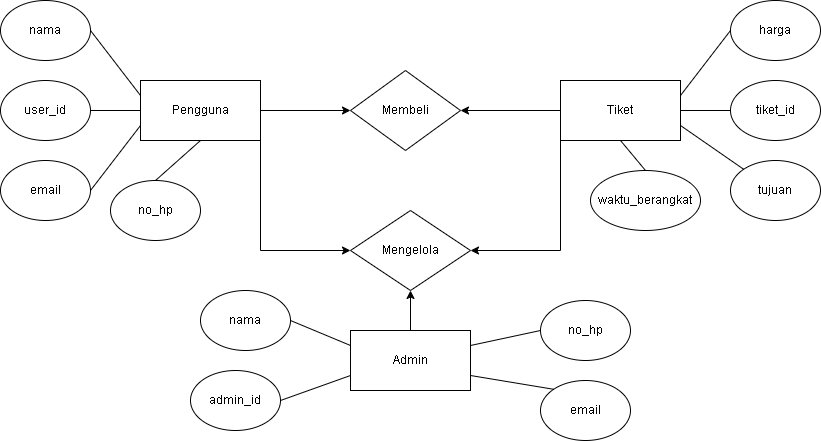
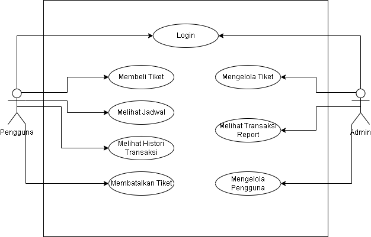

- Gambarkan desain ERD dari sistem pembelian tiket kereta api!



- Gambarkan use case diagram dari sistem pembelian tiket kereta api!



- Terdapat sebuah query pada SQL yaitu `SELECT * FROM users;` Dengan tujuan yang sama, tuliskan dalam bentuk perintah:
    - Redis

    ```
    HGETALL users
    ```

    - Neo4j
    
    ```
    MATCH (u:User)
    RETURN u;
    ```
    
    - Cassandra

    ```
    SELECT * FROM users;
    ```