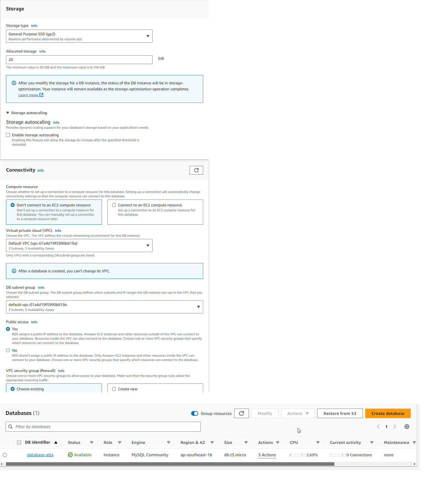
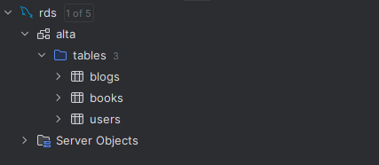

# Summary

# Tugas
## Deployment with EC2

1. Membuat VM di EC2, dan Implementasi Security Group EC2.

2. Melakukan SSH Remote ke VM di AWS EC2 (Dengan Key) serta dijelaskan key dan password.

3. Deploy your Program to EC2.

## Deployment using RDS

1. Membuat DB di RDS.
   

3. Migrate Your Local Data to RDS.
   

5. Connect Your Application to RDS.
   

